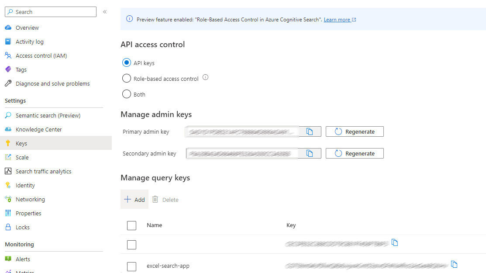
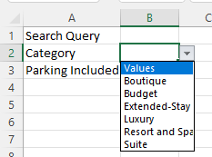

# How to Create an Excel Search Application

Search applications are typically supported through Web applications, however, these can often be time consuming to create and often the people that need to create these applications may not have the development background or time to create these applications. Furthermore, there may be times where a browser is not the preferred place to work with the data and it may be productivity tools such as Excel that are more preferrable. This tutorial is intended to show how to create a search applicaiton from within Excel that requires no-coding (other than some Power Query scripting) with very little effort. Since this tutorial leverages Power Query, with very few changes it could be adapted to provide the same functionality in Power BI.


## What is Needed
- This tutorial leverages [Azure Cognitive Search](https://learn.microsoft.com/azure/search/search-what-is-azure-search) as the search engine and you will require an Azure Subscription ([Free Subscription](https://azure.microsoft.com/free/))
- Excel 

## Getting Started
### Create the Azure Cognitive Search Index
For this tutorial we will use a sample index that comes with Azure Cognitive Search called Hotels, which is a data source consisting of fictitious hotel data. We will use this dataset to allow us to search and filter the hotel rooms within this search index.

Follow the instructions in [this page](https://learn.microsoft.com/en-us/azure/search/search-get-started-portal) to create and explore the hotel index from the Azure Portal.

### Enable CORS
Since the Excel application will connect directly to the search index, we need to enable CORS for this index. To do this, in the Azure Portal choose the "Indexes" tab and click on the "hotels-sample-index". Click "CORS" and select "All" as the allowed origin type and choose "Save".


### Create a Query API Key
All queries to Azure Cognitive Search need to be authenticated. Since we will be querying from Excel, we will want to create a Query API key as this key has limited priviledges to the search index and also sufficient priviledges to suppor the Excel search application. To create this key, choose the "Keys" option from the main page of your Azure Cognitive Search service.

Under "Manage Query Keys" choose "Add". Name the key "excel-search-app" and choose "Done".

Copy the resulting Query Key and save this for a future step.



## Create the Excel Search Application
Now that we have a search index, we will create a new Excel spreadsheet for this search application. In this step we will leverage Power Query to execute the search queries that are shown. To get started create a new Excel blank spreadsheet and name it excel-hotel-search-app.xlsx.

Next we will create some Power Queries. The first one we will create will retrieve all of the unique facet values (categories) for a particular field. For our tutorial we will use the facetable fields Category & ParkingIncluded. 

### Retrieve all Categories 
To create a query to get all the Categories, choose Data -> Get Data -> From Other Sources -> Blank Query. This will open Power Query and create a query titled Query1. Right click and choose "Rename" and name the query "facetCategories".


Right click on facetCategories and choose "Advanced Editor".
To allow us to retrieve the ratings, we simply need to replace any reference to the work "Category" with the work "Rating".


Paste the following code:

```
let
    Source = Json.Document(Web.Contents("https://YOUR_SEARCHSERVICENAME.search.windows.net/indexes/hotels-sample-index/docs?api-version=2021-04-30-Preview&search=*&facet=Category%2Ccount%3A0&top=0", [Headers=[#"api-key"="YOUR_QUERYAPIKEY"]])),
    #"@search facets" = Source[#"@search.facets"],
    facets = #"@search facets"[Category],
    #"Converted to Table" = Table.FromList(facets, Splitter.SplitByNothing(), null, null, ExtraValues.Error),
    #"Expanded Column1" = Table.ExpandRecordColumn(#"Converted to Table", "Column1", {"value"}, {"Column1.value"}),
    #"Renamed Columns" = Table.RenameColumns(#"Expanded Column1",{{"Column1.value", "Values"}}),
    #"Sorted Rows" = Table.Sort(#"Renamed Columns",{{"Values", Order.Ascending}})
in
    #"Sorted Rows"
```

Update YOUR_SEARCHSERVICENAME to your Azure Cognitive Search service name and update YOUR_QUERYAPIKEY to the Query API Key you created in the above step.
Click Done and you should see a table that shows all the possible categories.


### Retrieve all Parking Included values
To create a query to get all the ParkingIncluded, we will duplicate the previous query and modify it. To do this, right click on "facetCategories" and choose "Duplicate".
Right click on the duplicated query and name it facetParkingIncluded.
Right click on facetParkingIncluded and choose "Advanced Editor".
Update the two refereces of "Category" to "ParkingIncluded".
Click Done and you should see a table that shows all the possible values for ParkingIncluded (True and False).

Close the Power Query Editor and chooose "Keep".

You should now see two new workbook tabs called "facetParkingIncluded" and "facetCategories".


## Name the tables
We now need to name the resulting tables that exist within the workbooks so that the search interface we will create later can refer to them. 

Open the facetCategories tab and click on cell A1 and choose Ctrl-F3 to open the Name Manager.
Press "New" and set:

```
Name: categoryTable
Scope: Workbook
Refers To: =facetCategories!$A:$A
```
Choose OK.

Next we will do the same for "Parking Included".
Click "Add" and enter:

```
Name: parkingIncludedTable
Scope: Workbook
Refers To: =facetParkingIncluded!$A:$A
```
Choose OK.

Close the Name Manager.

## Create the Search Interface

Now that we have retrieved the facets and names the resulting tables, we will create a workbook that allows us to do full text search and to leverage these facets to refine the search results.

Right click and rename the workbook "Sheet1" to "Search" and drag it to the left so it is the first workbook of the workbook.

### Create the filters and name them
In the "Search" workbook add the following text into cells A1, A2 and A3

```
Search Query
Category
Parking Included
```

Cells B1, B2 and B3 will be used to eithen enter the search query (B1) or choose the filters (B2, B3). The filters will be a drop down box populated with the facet values we previously created queries for.

Next we will name cells B1, B2 and B3 as follows (see below image for where to enter the name). Remember to press ENTER after entering the name for the cell:

```
searchQuery
filterCategory
filterParkingIncluded
```


### Link filters to queries as lists
Now we will link the cells B2 and B3 to the facet tables so that a drop down list can automatically be populated.

Click on cell B2 and choose "Data Validation" under Data -> Data Tools


Link the list by entering:

```
Allow: List
Source: =categoryTable
```

Click OK

To create the drop down for Parking Included click on cell B3 and choose "Data Validation" under Data -> Data Tools
Link the list by entering:

```
Allow: List
Source: =parkingIncludedTable
```

Click OK and close the Data Validation Window.

Move the mouse to the right of cell B2 and choose the drop down list to verify data is being retrieved. You should notice that the header from the table "Values" is being included. We will fix this next.



### Allowing "All" Filter Values
There will be cases where you don't actually want to filter results. For example, you might not may not care if parking is or is not included. Since the Parking Included list only has a True and False option, it would be good if we could allow for "All" as an option.

Luckily an easy fix for this is to go to the Workbooks facetParkingIncluded and facetCategories and change the Header "Values" in cell A1 to "All".

Open workbook facetCategories and update the text of cell A1 from "Values" to "All"
Open workbook facetParkingIncluded and update the text of cell A1 from "Values" to "All"

Go back to the "Search" workbook and verify that "All" is an option in the lists.

### Create the Search Query
We now have everything we need to execute the actual search query that leverages the search query text and search filters.

Create a new blank query by choosing Home->Get Data->From Other Sources->Blank Query

Right click on the new query and name it postSearchQuery

Right click on postSearchQuery and choose Advanced Editor

Enter the following into the editor

```
let
    url = "https://YOUR_SEARCHSERVICENAME.search.windows.net/indexes/hotels-sample-index/docs/search?api-version=2021-04-30-Preview",
    queryApiKey = "YOUR_QUERYAPIKEY",
    // Create the search string - need an if for case where it is empty
    searchQueryStr =if Excel.CurrentWorkbook(){[Name="searchQuery"]}[Content]{0}[Column1] <> null then """search"": """ & Excel.CurrentWorkbook(){[Name="searchQuery"]}[Content]{0}[Column1] & """" else """search"": ""*""",
    categoryFilter = if Excel.CurrentWorkbook(){[Name="filterCategory"]}[Content]{0}[Column1] <> "All" and Excel.CurrentWorkbook(){[Name="filterCategory"]}[Content]{0}[Column1] <> null then """filter"": ""Category eq '" & Excel.CurrentWorkbook(){[Name="filterCategory"]}[Content]{0}[Column1] & "'""," else "",
    parkingIncludedFilter = if Excel.CurrentWorkbook(){[Name="filterParkingIncluded"]}[Content]{0}[Column1] <> "All" and Excel.CurrentWorkbook(){[Name="filterCategory"]}[Content]{0}[Column1] <> null then """filter"": ""ParkingIncluded eq '" & Excel.CurrentWorkbook(){[Name="filterParkingIncluded"]}[Content]{0}[Column1] & "'""," else "",
    body = "{""queryType"": ""simple"", " & categoryFilter & parkingIncludedFilter & searchQueryStr & "}",
    Source = Json.Document(Web.Contents(url,[Headers = [#"Content-Type"="application/json", #"api-key"=queryApiKey], Content=Text.ToBinary(body)  ] )),
    value = Source[value],
    #"Converted to Table" = Table.FromList(value, Splitter.SplitByNothing(), null, null, ExtraValues.Error),
    #"Expanded Column1" = Table.ExpandRecordColumn(#"Converted to Table", "Column1", {"HotelId", "HotelName", "Description", "Description_fr", "Category", "Tags", "ParkingIncluded", "LastRenovationDate", "Rating", "Location", "Address", "Rooms"}, {"Column1.HotelId", "Column1.HotelName", "Column1.Description", "Column1.Description_fr", "Column1.Category", "Column1.Tags", "Column1.ParkingIncluded", "Column1.LastRenovationDate", "Column1.Rating", "Column1.Location", "Column1.Address", "Column1.Rooms"})
in
    #"Expanded Column1"```
```

Update YOUR_SEARCHSERVICENAME to your Azure Cognitive Search service name and update YOUR_QUERYAPIKEY to the Query API Key you created in the above step.
Click Done and you should see a table that shows all the possible search results based on the selected filter and text search.

Close the Power Query Editor and Keep the changes.

### Clean up the Search Interface

From the last step you should see a table that shows the results of the search query. To make the search interface more usable, we will combine the search results, search query and filters into a single workbook.

Rename the workbook "postSearchQuery" to "Search App"

Insert 4 rows above the search results table.

Go to the "Search" workbook and cut cells A1 to B3 into clipboard.

Go to the "Search App" workbook and paste the cells at B1.

The result should look like this:


At this point you should be able to choose a value in the dropdown or enter text into cell C1 for the search query and then choose Data->Refresh All to execute the query.

### Add a Search Button to Execute Search (Optional)

To make things simpler, we are going to add a search button that will execute the query to retrieve the data and populate the resulting table. This requires you to save the file as an Macro Enabled Workbook so you may choose to skip this step.

To create the search button:

Save the file as a Excel Macro Enabled Workbook with a file type of (*.xlsm).
In the "Search App" workbook, go to cell A1.
From the menu choose Insert -> Icons
Type "Search" into the box and choose the icon for your button and press "Insert"
Resize and move the icon to where you would like it placed.
Right click on the icon and choose "Assign Macro"
Choose "New" and paste the following code:

```
Sub RefreshSearchResults()
    ThisWorkbook.Queries("postSearchQuery").Refresh
End Sub
```

Close the VBA Editor window.

Enter a value into cell C1 for the search text such as "chic" and press the search button. You should see the results refreshed. In the event this does not work, try right clicking the image and choose "Assign Macro", choose RefreshSearchResults, close the window and try again.


